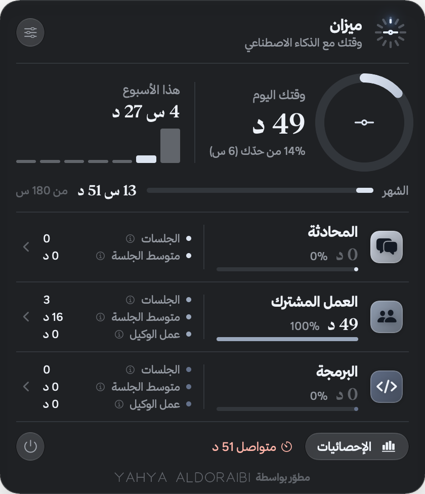

<div dir="rtl">

# ميزان

**وقتك مع الذكاء الاصطناعي، بميزان.**

تطبيق صغير لشريط قوائم الماك يحسب تلقائياً وقتك مع أدوات الذكاء الاصطناعي: كلود (المحادثة، والعمل المشترك، والبرمجة)، وشات جي بي تي، وجيمناي. محلي بالكامل، بلا إنترنت، وبياناتك لا تغادر جهازك.

**التحميل وطريقة التركيب:** [aldoraibi.github.io/mizan](https://aldoraibi.github.io/mizan)



## المزايا

- قياس تلقائي حسب الأداة المفتوحة أمامك، ولا يُحسب الوقت وأنت بعيد عن الجهاز.
- شعار يعدّ الساعات: كل علامة ساعة من يومك، والزائد عن حدّك بلون التحذير.
- «ساعة يومك»: حلقة ٢٤ ساعة تبيّن متى اشتغلت.
- إحصائيات يومية وأسبوعية وشهرية، وأرشيف للأشهر، وتقارير PDF وCSV.
- تذكير بالراحة، وتنبيه عند تجاوز الحد اليومي.
- عربي بالكامل، مع واجهة إنجليزية اختيارية.

## الخصوصية

- لا اتصال بالشبكة إطلاقاً، ولا حسابات، ولا تحليلات.
- البيانات في قاعدة SQLite محلية داخل `~/Library/Application Support/Mizan/`.
- صلاحية تسهيلات الاستخدام (Accessibility) تُستخدم لقراءة **عنوان الصفحة المفتوحة فقط**، لمعرفة القسم أو الموقع. لا يُقرأ محتوى المحادثات.

## البناء من المصدر

**للبناء:** Xcode 26 فأحدث (حزمة macOS 26 SDK)، لأن المصدر يستخدم واجهات Liquid Glass. **للتشغيل:** macOS 14 فأحدث؛ على الإصدارات الأقدم من 26 تُستخدم مواد شفافة عادية بدلها.

**المعماريات:**
- Apple Silicon (`arm64`)
- Intel (`x86_64`)

يبني السكربت الشريحتين كلاً على حدة ثم يدمجهما بـ `lipo` في ملف تنفيذي واحد (Universal) داخل `Mizan.app`، ويتحقق من وجودهما قبل التوقيع وبعده، ويفشل إن غابت إحداهما.

```sh
./scripts/build-app.sh            # يبني build/Mizan.app (arm64 + x86_64)
./scripts/build-app.sh --install  # يبنيه ويثبّته في مجلد التطبيقات
MIZAN_ARCHS=x86_64 ./scripts/build-app.sh   # شريحة واحدة صراحةً (اختياري)
swift test                        # الاختبارات
```

## شكر

- [خط ثمانية](https://font.thmanyah.com/)، مجاني للاستخدام في واجهات التطبيقات والمواقع.

## الرخصة

MIT © 2026 Yahya Aldoraibi

</div>
